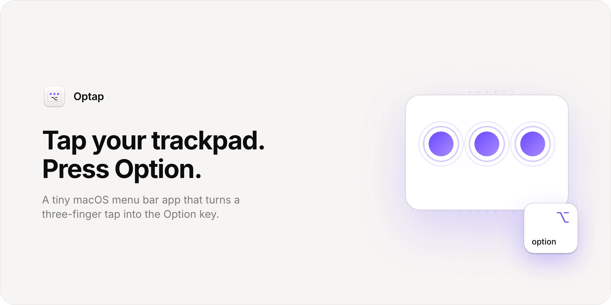

<picture>
  <source media="(prefers-color-scheme: dark)" srcset="docs/banner-dark.png">
  
</picture>

Some apps start something when you tap or hold Option, like dictation or push-to-talk. Optap lets you do that from the trackpad, without BetterTouchTool.

## Gestures

Pick one from the menu bar:

- **Three-finger tap:** a quick tap sends one Option press and release.
- **Four-finger tap:** the same with four fingers.
- **Three-finger hold:** Option stays down while three fingers rest on the trackpad and comes up when you lift.

A tap has to finish within 0.3 seconds without moving, so swipes and scrolls don't trigger it.

## Setup

1. Build and open Optap (see below). An ⌥ icon appears in the menu bar.
2. Grant Accessibility when macOS asks. Optap needs it to send the Option key. If you missed the prompt, choose **Grant Accessibility…** from the menu.
3. If macOS already uses three-finger tap (Look up & data detectors) or three-finger drag, turn that off in System Settings > Trackpad, or pick the four-finger tap.

**Open at Login** is in the menu.

## How it works

Optap reads raw touches from Apple's private `MultitouchSupport` framework, the same one BetterTouchTool uses. It counts the fingers touching the trackpad in each frame and checks how long they stayed and how far they moved. When the gesture matches, it posts an Option `flagsChanged` event with `CGEvent`. Optap has no network access, no analytics, and stores only your gesture choice.

Because the framework is private, a future macOS update could break it.

## Build

Requirements: macOS 15 or later on Apple silicon and the Xcode Command Line Tools. You don't need Xcode.

```sh
./build.sh
open build/Optap.app
```

macOS ties the Accessibility permission to the app's signature. `build.sh` signs with a code signing certificate named "Optap Local Signing" if your keychain has one, so the permission survives rebuilds. Without it the build is ad-hoc signed, and after each rebuild you need to remove Optap from System Settings > Privacy & Security > Accessibility and add it again.

To redraw the icon: `swift scripts/render-icon.swift`. To redraw the README banner: `scripts/render-banner.sh` (needs Google Chrome).

## License

MIT
